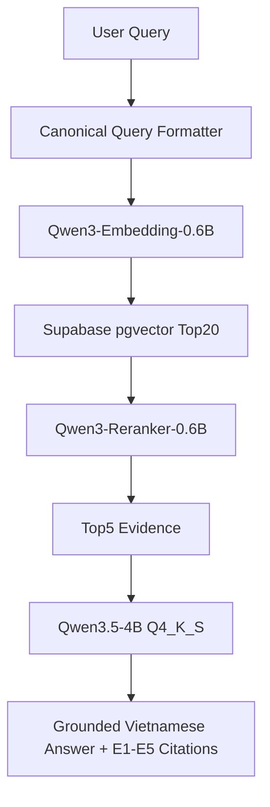

# Digital Expert Agents — MVP

Multi-agent credit assessment MVP for corporate banking. A LangGraph orchestrator coordinates five specialist agents, a reviewer/debate loop, a human approval gate, and post-approval operations. Policy knowledge is retrieved from per-agent pgvector knowledge bases; customer case documents remain isolated from durable policy memory.

The first product slice is **SME unsecured working-capital loan
pre-screening**. Read the [product documentation](docs/README.md) before
adding new workflows or policy data.

The accepted MVP retrieval design is documented in
[RAG architecture](docs/RAG-ARCHITECTURE.md), with the implementation order in
the [MVP delivery plan](docs/MVP-DELIVERY-PLAN.md).

The versioned, machine-readable dataset contract lives in
[dataset/README.md](dataset/README.md).

## BANK-RAG V1 baseline

**Development status: BANK-RAG V1 BASELINE COMPLETE.** This repository also
contains a fully-local compact Vietnamese banking RAG baseline. Its purpose is
to retrieve policy and regulatory evidence for grounded answers; it is not a
production or legal-authority claim.



The retrieval filter allows `SHARED` evidence for supported specialist scopes
and `SCOPED` evidence only with explicit authorization. Supported scopes are
`credit`, `risk_management`, `legal_compliance`, `customer_relationship`, and
`collateral_appraisal`; `BankingOperations` is metadata-only and is not a
specialist scope. The V1 data stack is Supabase PostgreSQL/pgvector with
private Storage buckets. The canonical corpus is `policy-corpus-v2` with
1,610 chunks: 1,573 real-authoritative and 37 synthetic/internal-policy.

The frozen pipeline is query formatting -> Qwen3-Embedding-0.6B -> canonical
Supabase vector Top20 -> Qwen3-Reranker-0.6B Q8_0 -> Top5 evidence -> local
Qwen3.5-4B generation. Answers are required to be grounded in the supplied
evidence and use citations `[E1]` through `[E5]`.

On the 100-query human-reviewed retrieval gold, the frozen retrieval result
was Hit@5 0.9700, Recall@5 0.9700, MRR@5 0.8928, and nDCG@5 0.9118. The first
end-to-end local generation evaluation had 72/100 clean answers by human
review. These are descriptive baseline results, not answer accuracy claims,
production SLAs, statistical significance, or SOTA evidence.

Reference measurements use an NVIDIA RTX 2050 with 4 GB VRAM and llama.cpp /
Vulkan. Reranker p50 was 2,430.854 ms and generator p50 was 13,850.037 ms;
both are local reference measurements, not production SLAs.

Known limitations include three Top20 candidate-generation failures, legal
polarity interpretation errors, insufficient abstention, citation-discipline
issues, output truncation, evidence extrapolation, and a known synthetic
provenance presentation bug. They are recorded in the closure document and
are not silently corrected in V1.

Key V1 documentation:

- [V1 baseline closure](docs/BANK-RAG-V1-BASELINE.md)
- [Retrieval architecture freeze](docs/STAGE-13F-RETRIEVAL-ARCHITECTURE-FREEZE.md)
- [Generation baseline](docs/STAGE-14A-RAG-BASELINE.md)
- [Human semantic baseline](docs/STAGE-14B-HUMAN-SEMANTIC-BASELINE-FREEZE.md)
- [Dataset contract](dataset/README.md)

## Run the real-agent demo

1. Revoke any API key that has been pasted into chat or source control, then create a fresh key.
2. Copy `.env.example` to `.env` and set `LLM_API_KEY` and `EMBEDDING_API_KEY` there. Never commit `.env`.
3. Start the stack:

   ```bash
   docker compose up --build
   ```

4. Open `http://localhost:3000`. The bootstrap process uploads and embeds `backend/resources/policies/QD-HHB-2026-01.txt`, then creates a demo case with a fictional dossier ready to assess.

The case workspace now contains a live Agent Control Center. Assessment requests return immediately while the LLM agents run in the backend. The page receives operational events over SSE, updates each specialist result as soon as it is posted, and visualizes Reviewer → Specialist challenges. “Dừng an toàn” finishes the current provider call and pauses at the next durable PostgreSQL checkpoint; “Tiếp tục từ checkpoint” resumes without rerunning completed specialists.

If you already have an older Minh An demo stopped in `TIER1_PLANNING` or `TIER2_DEBATING`, use “Khôi phục phiên thẩm định”. On the next `docker compose up --build`, Alembic automatically adds the runtime/checkpoint tables before the API starts.

The default runtime uses the FPT AI Marketplace OpenAI-compatible endpoint (https://mkp-api.fptcloud.com). Generation and embeddings are configured independently: set `LLM_API_KEY` for `GLM-5.2` (structured agent calls) and `EMBEDDING_API_KEY` for `Vietnamese_Embedding` (RAG). You can override the endpoint for either by setting `LLM_API_BASE` and `EMBEDDING_API_BASE` independently. It fails closed when a model call fails; deterministic embeddings are accepted only when `ENVIRONMENT=test`.

## Local verification

```bash
.venv/bin/python -m pytest backend/tests -q
cd frontend
npm run lint
npm run typecheck
npm test
npm run build
```

The demo uses header authentication and mock core-banking endpoints. Set `AUTH_MODE=jwt`, disable mock APIs, and configure issuer/JWKS values before deploying outside development.
